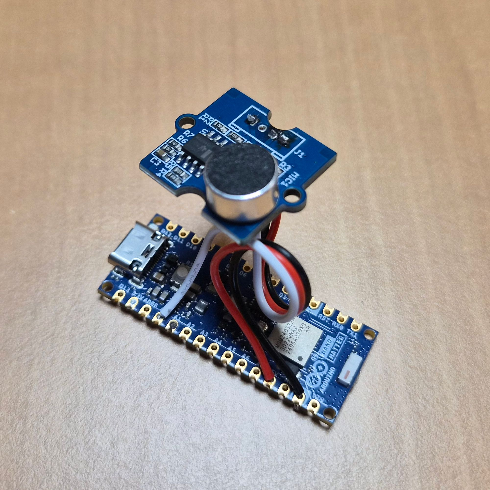
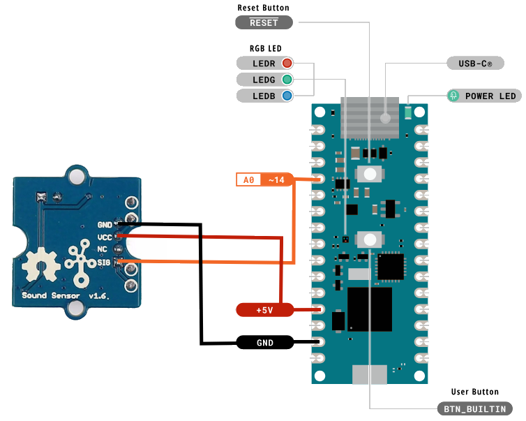

# Capteur Sonore Matter

Assemblage et programmation

---

Il n’existe actuellement dans le commerce aucun capteur de niveau sonore. Il existe quelques alarmes de détection de pic sonore, mais elles ne correspondent pas au besoin. D’ailleurs, les normes Zigbee et Matter ne prennent pas en charge les capteurs sonores dans leurs modèles de données. Une démarche est en cours auprès de la CSA pour l’intégrer dans les prochaines versions des protocoles.

## Assemblage

Pour connecter la carte Arduino Nano Matter et le capteur sonore Grove (réf. 101020023), il faut relier les 3 ports suivants et les souder à l’étain :

- SIG ↔ A0  
- GND ↔ GND  
- VCC ↔ 5V

## Programmation

Maintenant que le capteur est assemblé, il faut y mettre le programme. Pour cela, il faut un ordinateur muni du logiciel « Arduino IDE », sur lequel il faut ajouter les modules **Arduino AVR Boards** et **Silicon Labs** (voir captures ci-dessous).

 

Une fois ces modules installés, il faut choisir le bon modèle de « Board » et le bon port de connexion.

  

Vous pouvez également ouvrir le programme `sonometre_vX.ino`.

Une fois arrivé à cette étape, vous pouvez écraser le logiciel de démarrage de la carte en cliquant sur :
`Tools >> Burn Bootloader`
pour la préparer à recevoir le programme.

Une fois terminé, vous pouvez lancer le téléversement du programme sur le capteur.

Le capteur est prêt !

## Appairage

Pour l’appairer au contrôleur domotique, vous aurez besoin de ce QR Code ou du code d’appairage manuel : **34970112332**

---

Fichiers images référencés (relatifs au dépôt) :
- Capteur sonore_html_34c03754.png
- Capteur sonore_html_4557f30c.png
- Capteur sonore_html_485a56b6.png
- Capteur sonore_html_f8f30e2b.png
- Capteur sonore_html_eb72a2f.png
- Capteur sonore_html_25338ff2.png
- Capteur sonore_html_9e77c984.png
- Capteur sonore_html_1de0b1fc.png
